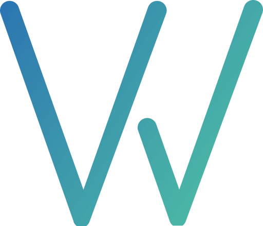

# [WebPoster | NextJs](https://my-web-site-roan-iota.vercel.app)




```bash
🚀 Website for a web application development company has more than 5 pages.
```

## 🛠 Skills

This project is used by the following skills:

**Technologies:** `React`, `NextJs`, `TypeScript`, `SCSS`

**Libraries:** `Tailwind CSS`, `NextUI`


