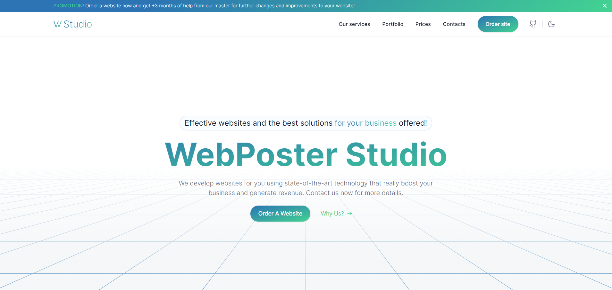

# [WebPoster | NextJs](https://web-poster-nextjs.vercel.app)

Welcome to the WebPoster project repository! We are here to show you an incredible website for a web application development company!



## 🤖 About WebPoster
📋 Website for a web application development company has more than 5 pages.

## 🛠 Technologies Used

We've assembled quite the tech stack to bring WebPoster to life:

- [React](https://react.dev/)
- [NextJs](https://nextjs.org/)
- [TypeScript](https://www.typescriptlang.org/)
- [Scss](https://sasscss.org/)

**Libraries:** `Tailwind CSS`, `NextUI`, `React-Hot-Toast`, `Framer Motion`, `Atropos`
**Libraries:** [`TailwindCss`](https://tailwindcss.com/), [`NextUI`](https://nextui.org/),[`Framer Motion`](https://www.framer.com/motion/), [`Atropos`](https://atroposjs.com/),  [`Resend`](https://resend.com/), [`React-Hot-Toast`](https://react-hot-toast.com/)`
## 🚀 Getting Started

- Clone the repository
- Install dependencies with `npm install`
 ```bash
  npm install
  ```
- Run the development server with `npm run dev`
 ```bash
  npm run dev
  ```
- Open your browser and navigate to `http://localhost:3000`

## 📜 Disclaimer
WebPoster is a fictional company created for demonstration purposes only. Any resemblance to real companies, living or dead, is purely coincidental.

## 🤝 Contributing
While WebPoster isn't a real company, your contributions to this project are real and valued! Feel free to open issues or submit pull requests if you have ideas for improvements. Thank you!

